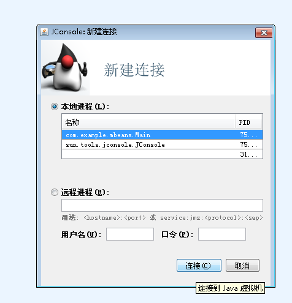
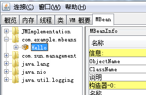
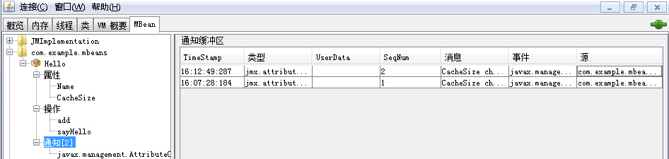
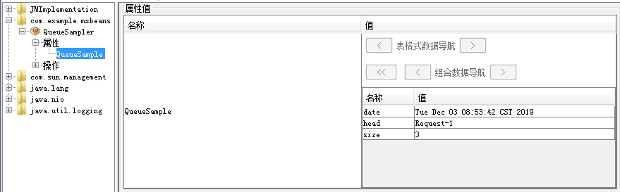

---

typora-copy-images-to: pic
---

# JMX编程入门

## 一、理论部分

参考 《Java服务的监控指标框架》一文

## 二、实践部分

### 第一例子：标准MBeans 

标准的MBean的定义是：定义一个命名规范为SomethingMBean的Java接口，并通过一个命名为Something的Java类来实现这个接口。

样例代码

#### MBean接口

定义HelloMBean接口，包含了两个操作sayHello和add，两个属性Name和CacheSize相关的方法。 

```
package com.example.mbeans;

public interface HelloMBean {
    // operations

    public void sayHello();
    public int add(int x, int y);

    // attributes

    // a read-only attribute called Name of type String
    public String getName();

    // a read-write attribute called CacheSize of type int
    public int getCacheSize();
    public void setCacheSize(int size);
}
```

#### MBean 实现

Hello类实现了HelloMBean接口声明的方法。

```
package com.example.mbeans;

public class Hello implements HelloMBean {
    public void sayHello() {
        System.out.println("hello, world");
    }

    public int add(int x, int y) {
        return x + y;
    }

    /* Getter for the Name attribute.  The pattern shown here is
       frequent: the getter returns a private field representing the
       attribute value.  In our case, the attribute value never
       changes, but for other attributes it might change as the
       application runs.  Consider an attribute representing
       statistics such as uptime or memory usage, for example.  Being
       read-only just means that it can't be changed through the
       management interface.  */
    public String getName() {
        return this.name;
    }

    /* Getter for the CacheSize attribute.  The pattern shown here is
       frequent: the getter returns a private field representing the
       attribute value, and the setter changes that field.  */
    public int getCacheSize() {
        return this.cacheSize;
    }

    /* Setter for the CacheSize attribute.  To avoid problems with
       stale values in multithreaded situations, it is a good idea
       for setters to be synchronized.  */
    public synchronized void setCacheSize(int size) {
        this.cacheSize = size;

        /* In a real application, changing the attribute would
           typically have effects beyond just modifying the cacheSize
           field.  For example, resizing the cache might mean
           discarding entries or allocating new ones.  The logic for
           these effects would be here.  */
        System.out.println("Cache size now " + this.cacheSize);
    }

    private final String name = "Reginald";
    private int cacheSize = DEFAULT_CACHE_SIZE;
    private static final int DEFAULT_CACHE_SIZE = 200;
}
```

#### 资源管理

创建一个标准的JMX 代理：Main。

首先，Main通过调用java.lang.management.ManagementFactory类中的getPlatformMBeanServer()方法获取平台上的MBean server，如果MBean server不存在，getPlatformMBeanServer()方法会调用ManagementFactory.createMBeanServer()创建一个MBean Server。Main中获取MBeanServer实例并命名为*mbs*。每一个JMX MBean都必须有一个object name，object name是JMX中ObjectName类的实例，其定义需要符合JMX 规范中定义的语法，即必须包含一个domain和一系列key-properties。Main中object name命名为*name*，其domain为com.example.mbeans，key-property声明这个对象是Hello类型。Hello MBean注册到MBean server后，Main会一直等待。


```
package com.example.mbeans;

import java.lang.management.*;
import javax.management.*;

public class Main {
    /* For simplicity, we declare "throws Exception".  Real programs
       will usually want finer-grained exception handling.  */
    public static void main(String[] args) throws Exception {
        // Get the Platform MBean Server
        MBeanServer mbs = ManagementFactory.getPlatformMBeanServer();

        // Construct the ObjectName for the MBean we will register
        ObjectName name = new ObjectName("com.example.mbeans:type=Hello");

        // Create the Hello World MBean
        Hello mbean = new Hello();

        // Register the Hello World MBean
        mbs.registerMBean(mbean, name);

        // Wait forever
        System.out.println("Waiting forever...");
        Thread.sleep(Long.MAX_VALUE);
    }
}

```

#### 运行步骤

1、代码框架如图


2、编译

本地存放的路径：E:\doc\book\language\Java\JMX\jmx_examples\Essential\

```
javac com/example/mbeans/*.java
```

3、运行Main

```
java com.example.mbeans.Main
```

4、启动JConsole

```
jconsole
```

5、选择com.example.mbeans.Main,新建连接



6、MBeans tab页可以看到所有注册到MBean server的MBeans。



7、通过左侧MBean树形结构，可以对Hello MBean的属性与操作进行控制。

修改CacheSize属性值


调用sayHello()方法


8、退出JConsole。

### 第二个例子：MBean  *Notification* 通知机制

Mbean之间的通信是必不可少，Notification就起到了Mbean 之间沟通桥梁的作用。JMX notification model 和 java event model 类似，将一些重要的信息，状态的转变，数据的变更传递给 notification listener，以使资源更容易管理。

相比第一个例子，在MBean中只需将*NotificationBroadcaster*接口实现即可激活Notification。

样例代码

```
package com.example.mbeans;

import javax.management.*;

public class Hello
        extends NotificationBroadcasterSupport implements HelloMBean {

    public void sayHello() {
        System.out.println("hello, world");
    }

    public int add(int x, int y) {
        return x + y;
    }

    /* Getter for the Name attribute.  The pattern shown here is
       frequent: the getter returns a private field representing the
       attribute value.  In our case, the attribute value never
       changes, but for other attributes it might change as the
       application runs.  Consider an attribute representing
       statistics such as uptime or memory usage, for example.  Being
       read-only just means that it can't be changed through the
       management interface.  */
    public String getName() {
        return this.name;
    }

    /* Getter for the CacheSize attribute.  The pattern shown here is
       frequent: the getter returns a private field representing the
       attribute value, and the setter changes that field.  */
    public int getCacheSize() {
        return this.cacheSize;
    }

    /* Setter for the CacheSize attribute.  To avoid problems with
       stale values in multithreaded situations, it is a good idea
       for setters to be synchronized.  */
    public synchronized void setCacheSize(int size) {
        int oldSize = this.cacheSize;
        this.cacheSize = size;

        /* In a real application, changing the attribute would
           typically have effects beyond just modifying the cacheSize
           field.  For example, resizing the cache might mean
           discarding entries or allocating new ones.  The logic for
           these effects would be here.  */
        System.out.println("Cache size now " + this.cacheSize);

        /* Construct a notification that describes the change.  The
           "source" of a notification is the ObjectName of the MBean
           that emitted it.  But an MBean can put a reference to
           itself ("this") in the source, and the MBean server will
           replace this with the ObjectName before sending the
           notification on to its clients.

           For good measure, we maintain a sequence number for each
           notification emitted by this MBean.

           The oldValue and newValue parameters to the constructor are
           of type Object, so we are relying on Tiger's autoboxing
           here.  */
        Notification n =
            new AttributeChangeNotification(this,
                                            sequenceNumber++,
                                            System.currentTimeMillis(),
                                            "CacheSize changed",
                                            "CacheSize",
                                            "int",
                                            oldSize,
                                            this.cacheSize);

        /* Now send the notification using the sendNotification method
           inherited from the parent class
           NotificationBroadcasterSupport.  */
        sendNotification(n);
    }

    @Override
    public MBeanNotificationInfo[] getNotificationInfo() {
        String[] types = new String[] {
            AttributeChangeNotification.ATTRIBUTE_CHANGE
        };
        String name = AttributeChangeNotification.class.getName();
        String description = "An attribute of this MBean has changed";
        MBeanNotificationInfo info =
            new MBeanNotificationInfo(types, name, description);
        return new MBeanNotificationInfo[] {info};
    }

    private final String name = "Reginald";
    private int cacheSize = DEFAULT_CACHE_SIZE;
    private static final int DEFAULT_CACHE_SIZE = 200;

    private long sequenceNumber = 1;
}

```

#### 运行步骤

1、代码框架如图


2、本地存放路径：E:\doc\book\language\Java\JMX\jmx_examples\Notification（可自行配置）

```
javac com/example/mbeans/*.java
```

3、运行Main

```
java com.example.mbeans.Main
```

4、启动JConsole

```
jconsole
```

5、选择com.example.mbeans.Main,新建连接


6、MBeans tab页可以看到所有注册到MBean server的MBeans。


7、通过左侧MBean树形结构，可以对Hello MBean的属性、操作和通知进行控制

点击订阅，目前通知接收值为1


修改CacheSize值


通知接收值变成了2，右侧有Hello MBean发送的Notification详情。



8、退出JConsole

### 第三个例子：MXBeans入门

MXBean也是JMX MBean的一种，与MBean的区别是：MXBean引用一组预定义的数据类型，通过这种方式，MBean可以被任何形式的客户端使用，包括远程客户端。MXBean提供一种方便的方式将相关值打包在一起,不需要客户专门配置为处理包。

一种理解是，MBean与MXBean的区别是：定义MBean接口实现类的属性时，MBean只支持Java的八种基本数据和一些简单的引用类型，如String。不能支持复杂数据类型的关联映射。而MXBean接口实现类定义属性时，支持基本数据类型，引用数据类型和自定义的数据类型。

MBean与MXBean编写规则非常相似,同样是定义xxxMXBean interface,实现xxxMXBean接口;在编写MXBean接口时，也可以不以MXBean结尾，而在是接口上使用@MXBean注释，表示接口为MXBean接口。

#### QueueSamplerMXBean 接口

代码：声明了两个操作：getQueueSample和ClearQueue

```
package com.example.mxbeans;

public interface QueueSamplerMXBean {
    public QueueSample getQueueSample();
    public void clearQueue();
}
```

#### QueueSampler 类

getQueueSample（）操作返回的是QueueSample的一个实例。

```
package com.example.mxbeans;

import java.util.Date;
import java.util.Queue;

public class QueueSampler implements QueueSamplerMXBean {

    private Queue<String> queue;

    public QueueSampler(Queue<String> queue) {
        this.queue = queue;
    }

    public QueueSample getQueueSample() {
        synchronized (queue) {
            return new QueueSample(new Date(), queue.size(), queue.peek());
        }
    }

    public void clearQueue() {
        synchronized (queue) {
            queue.clear();
        }
    }
}
```

#### QueueSample类

在QueueSample类中，MXBean框架调用QueueSample中所有getter方法将所给实例转换成CompositeData类型实例，然后通过@ConstructorPorperties注解将CompositeData实例构建QueueSample类型实例。

```
package com.example.mxbeans;

import java.beans.ConstructorProperties;
import java.util.Date;

public class QueueSample {

    private final Date date;
    private final int size;
    private final String head;

    @ConstructorProperties({"date", "size", "head"})
    public QueueSample(Date date, int size, String head) {
        this.date = date;
        this.size = size;
        this.head = head;
    }

    public Date getDate() {
        return date;
    }

    public int getSize() {
        return size;
    }

    public String getHead() {
        return head;
    }
}
```

关于@ConstructorProperties注解用法参考：https://docs.oracle.com/javase/8/docs/api/java/beans/ConstructorProperties.html

#### MBean Server中创建和注册MXBean

```
package com.example.mxbeans;

import java.lang.management.ManagementFactory;
import java.util.Queue;
import java.util.concurrent.ArrayBlockingQueue;
import javax.management.MBeanServer;
import javax.management.ObjectName;

public class Main {
    /* For simplicity, we declare "throws Exception".  Real programs
       will usually want finer-grained exception handling.  */
    public static void main(String[] args) throws Exception {
        // Get the Platform MBean Server
        MBeanServer mbs = ManagementFactory.getPlatformMBeanServer();

        // Construct the ObjectName for the MBean we will register
        ObjectName name =
                new ObjectName("com.example.mxbeans:type=QueueSampler");

        // Create the Queue Sampler MXBean
        Queue<String> queue = new ArrayBlockingQueue<String>(10);
        queue.add("Request-1");
        queue.add("Request-2");
        queue.add("Request-3");
        QueueSampler mxbean = new QueueSampler(queue);

        // Register the Queue Sampler MXBean
        mbs.registerMBean(mxbean, name);

        // Wait forever
        System.out.println("Waiting...");
        Thread.sleep(Long.MAX_VALUE);
    }
}

```

#### 运行步骤

1、代码框架图


2、本地存放路径：E:\doc\book\language\Java\JMX\jmx_examples\mxbeans（可自行配置）

```
javac com/example/mxbeans/*.java
```

3、运行Main

```
java com.example.mxbeans.Main
```

4、启动JConsole

```
jconsole
```

5、选择com.example.mbeans.Main,新建连接


6、左侧的QueueSampler的属性节点 QueueSample的值为javax.management.openmbean.CompositeDataSupport。


7、双击CompositeDataSupport，可以看到QueueSample实例的date、head、size的属性值（MXBean框架将QueueSample实例转换成了CompositeData）。 如果将QueueSampler定义为标准的MBean而不是MXBean，JConsole就不会发现QueueSample类，因为它不会在它的类路径中。如果QueueSampler是一个标准的MBean，在访问QueueSample属性值时，您将收到一个ClassNotFoundException消息。 

8、退出JConsole

#### 访问MXBean资源的JMX clien侧代码

通常写法

```
MBeanServer mbs = ...whatever...;
ObjectName name = new
ObjectName("com.example.mxbeans:type=QueueSampler");
CompositeData queueSample = (CompositeData) mbs.getAttribute(name,
"QueueSample");
int size = (Integer) queueSample.get("size");
```

通过代理

```
MBeanServer mbs = ...whatever...;
ObjectName name = new
ObjectName("com.example.mxbeans:type=QueueSampler");
QueueSamplerMXBean proxy = JMX.newMXBeanProxy(mbs, name,
QueueSamplerMXBean.class);
QueueSample queueSample = proxy.getQueueSample();
int size = queueSample.getSize();
```

### 第四个例子：JMX Connectors例子

通过RMI Connector访问标准 MBeans和动态MBeans的资源。其中**动态MBean是在运行期才定义它的属性和方法，也就是说它有什么属性和方法是可以动态改变的。**动态MBean主要利用一些辅助类（构造函数类MBeanConstructorInfo、属性类MBeanAttributeInfo、方法类MBeanOperationInfo）来完成这个功能，所有的动态MBean必须实现DynamicMBean接口。

例子的整体框架：

Server端完成的功能：

— 创建一个MBean server

— 在本地MBean server注册一个标准MBean *SimpleStandard*和一个动态MBean *SimpleDynamic*  

— 本地执行MBean所提供的操作

— 创建 一个RMI connector server

Client端完成的功能：

— 创建一个RMI connector

— 在远程MBean serverz注册标准MBean *SimpleStandard*和动态MBean *SimpleDynamic*  

— 远程执行MBean所提供的操作

代码的分析

#### Server.java文件

片段1

首先，通过调用MBeanServerFactory类中的createMBeanServer()方法创建一个新的MBean server *mbs*。

其次，通过*createSimpleMBean()*方法创建并注册标准Mbean *SimpleStandard*，通过*printMBeanInfo()*方法获取并显示*SimpleStandard*对外暴露的管理资源，通过*manageSimpleMBean()*方法对 *SimpleStandard*做管理操作；类似的，创建并注册动态Mbean *SimpleDynamic*  ，获取并显示*SimpleDynamic*  对外暴露的管理资源，对 *SimpleDynamic*进行管理 操作。其中，*createSimpleMBean()*，*printMBeanInfo()*，*manageSimpleMBean()*方法在Server.java均有定义。

```
public class Server {

    public static void main(String[] args) {
        try {
            // Instantiate the MBean server
            //
            echo("\n>>> Create the MBean server");
            MBeanServer mbs = MBeanServerFactory.createMBeanServer();
            waitForEnterPressed();

            // Get default domain
            //
            echo("\n>>> Get the MBean server's default domain");
            String domain = mbs.getDefaultDomain();
            echo("\tDefault Domain = " + domain);
            waitForEnterPressed();

            // Create and register the SimpleStandard MBean
            //
            String mbeanClassName = "SimpleStandard";
            String mbeanObjectNameStr =
                domain + ":type=" + mbeanClassName + ",name=1";
            ObjectName mbeanObjectName =
                createSimpleMBean(mbs, mbeanClassName, mbeanObjectNameStr);
            waitForEnterPressed();

            // Get and display the management information exposed by the
            // SimpleStandard MBean
            //
            printMBeanInfo(mbs, mbeanObjectName, mbeanClassName);
            waitForEnterPressed();

            // Manage the SimpleStandard MBean
            //
            manageSimpleMBean(mbs, mbeanObjectName, mbeanClassName);
            waitForEnterPressed();

            // Create and register the SimpleDynamic MBean
            //
            mbeanClassName = "SimpleDynamic";
            mbeanObjectNameStr =
                domain + ":type=" + mbeanClassName + ",name=1";
            mbeanObjectName =
                createSimpleMBean(mbs, mbeanClassName, mbeanObjectNameStr);
            waitForEnterPressed();

            // Get and display the management information exposed by the
            // SimpleDynamic MBean
            //
            printMBeanInfo(mbs, mbeanObjectName, mbeanClassName);
            waitForEnterPressed();

            // Manage the SimpleDynamic MBean
            //
            manageSimpleMBean(mbs, mbeanObjectName, mbeanClassName);
            waitForEnterPressed();
            [...]
```

片段2

创建一个RMI connector server，关注下url的格式；启动RMI connector server，终止RMI connector server。

```
			[...]
			// Create an RMI connector server
            //
            echo("\nCreate an RMI connector server");
            JMXServiceURL url = new JMXServiceURL(
                      "service:jmx:rmi:///jndi/rmi://localhost:9999/server");
            JMXConnectorServer cs =
                JMXConnectorServerFactory.newJMXConnectorServer(url, null, mbs);

            // Start the RMI connector server
            //
            echo("\nStart the RMI connector server");
            cs.start();
            echo("\nThe RMI connector server successfully started");
            echo("and is ready to handle incoming connections");
            echo("\nStart the client on a different window and");
            echo("press <Enter> once the client has finished");
            waitForEnterPressed();

            // Stop the RMI connector server
            //
            echo("\nStop the RMI connector server");
            cs.stop();
            System.out.println("\nBye! Bye!");
			[...]
```

片段3

创建并注册MBean的实现代码

```
	[...]
	private static ObjectName createSimpleMBean(MBeanServer mbs,
                                                String mbeanClassName,
                                                String mbeanObjectNameStr) {
        echo("\n>>> Create the " + mbeanClassName +
             " MBean within the MBeanServer");
        echo("\tObjectName = " + mbeanObjectNameStr);
        try {
            ObjectName mbeanObjectName =
                ObjectName.getInstance(mbeanObjectNameStr);
            mbs.createMBean(mbeanClassName, mbeanObjectName);
            return mbeanObjectName;
        } catch (Exception e) {
            echo("\t!!! Could not create the " + mbeanClassName + " MBean !!!");
            e.printStackTrace();
            echo("\nEXITING...\n");
            System.exit(1);
        }
        return null;
    }
    [...]
```

片段4

通过调用MBean Server的getMBeanInfo()方法可以获取MBean对外暴露的属性和操作的细节，其对象类型为MBeanInfo。


mbeanObjectName.MBeanAttributeInfo可以获取MBean 属性的名称、注释、类型、可读写性相关信息。

mbeanObjectName.  MBeanConstructorInfo  获得MBean的java 类信息。

mbeanObjectName.  MBeanOperationInfo 可知MBean执行哪些操作，并需要配置哪些参数

mbeanObjectName.  MBeanNotificationInfo可以查询到MBean发送了哪些notifications。

```
	[...]
	private static void printMBeanInfo(MBeanServer mbs,
                                       ObjectName mbeanObjectName,
                                       String mbeanClassName) {
        echo("\n>>> Retrieve the management information for the " +
             mbeanClassName);
        echo("    MBean using the getMBeanInfo() method of the MBeanServer");
        MBeanInfo info = null;
        try {
            info = mbs.getMBeanInfo(mbeanObjectName);
        } catch (Exception e) {
            echo("\t!!! Could not get MBeanInfo object for " +
                 mbeanClassName +" !!!");
            e.printStackTrace();
            return;
        }
        echo("\nCLASSNAME: \t" + info.getClassName());
        echo("\nDESCRIPTION: \t" + info.getDescription());
        echo("\nATTRIBUTES");
        MBeanAttributeInfo[] attrInfo = info.getAttributes();
        if (attrInfo.length > 0) {
            for (int i = 0; i < attrInfo.length; i++) {
                echo(" ** NAME: \t" + attrInfo[i].getName());
                echo("    DESCR: \t" + attrInfo[i].getDescription());
                echo("    TYPE: \t" + attrInfo[i].getType() +
                     "\tREAD: "+ attrInfo[i].isReadable() +
                     "\tWRITE: "+ attrInfo[i].isWritable());
            }
        } else echo(" ** No attributes **");
        echo("\nCONSTRUCTORS");
        MBeanConstructorInfo[] constrInfo = info.getConstructors();
        for (int i=0; i<constrInfo.length; i++) {
            echo(" ** NAME: \t" + constrInfo[i].getName());
            echo("    DESCR: \t" + constrInfo[i].getDescription());
            echo("    PARAM: \t" + constrInfo[i].getSignature().length +
                 " parameter(s)");
        }
        echo("\nOPERATIONS");
        MBeanOperationInfo[] opInfo = info.getOperations();
        if (opInfo.length > 0) {
            for (int i = 0; i < opInfo.length; i++) {
                echo(" ** NAME: \t" + opInfo[i].getName());
                echo("    DESCR: \t" + opInfo[i].getDescription());
                echo("    PARAM: \t" + opInfo[i].getSignature().length +
                     " parameter(s)");
            }
        } else echo(" ** No operations ** ");
        echo("\nNOTIFICATIONS");
        MBeanNotificationInfo[] notifInfo = info.getNotifications();
        if (notifInfo.length > 0) {
            for (int i = 0; i < notifInfo.length; i++) {
                echo(" ** NAME: \t" + notifInfo[i].getName());
                echo("    DESCR: \t" + notifInfo[i].getDescription());
                String notifTypes[] = notifInfo[i].getNotifTypes();
                for (int j = 0; j < notifTypes.length; j++) {
                    echo("    TYPE: \t" + notifTypes[j]);
                }
            }
        } else echo(" ** No notifications **");
    }
    [...]
```

片段5

。。。。。。

```
	[...]
	private static void manageSimpleMBean(MBeanServer mbs,
                                          ObjectName mbeanObjectName,
                                          String mbeanClassName) {

        echo("\n>>> Manage the " + mbeanClassName +
             " MBean using its attributes ");
        echo("    and operations exposed for management");

        try {
            // Get attribute values
            printSimpleAttributes(mbs, mbeanObjectName);

            // Change State attribute
            echo("\n    Setting State attribute to value \"new state\"...");
            Attribute stateAttribute = new Attribute("State","new state");
            mbs.setAttribute(mbeanObjectName, stateAttribute);

            // Get attribute values
            printSimpleAttributes(mbs, mbeanObjectName);

            // Invoking reset operation
            echo("\n    Invoking reset operation...");
            mbs.invoke(mbeanObjectName, "reset", null, null);

            // Get attribute values
            printSimpleAttributes(mbs, mbeanObjectName);
        } catch (Exception e) {
            e.printStackTrace();
        }
    }
    private static void printSimpleAttributes(MBeanServer mbs,
                                              ObjectName mbeanObjectName) {
        try {
            echo("\n    Getting attribute values:");
            String State = (String) mbs.getAttribute(mbeanObjectName, "State");
            Integer NbChanges =
                (Integer) mbs.getAttribute(mbeanObjectName,"NbChanges");
            echo("\tState     = \"" + State + "\"");
            echo("\tNbChanges = " + NbChanges);
        } catch (Exception e) {
            echo("\t!!! Could not read attributes !!!");
            e.printStackTrace();
        }
    }
    [...]
```

####   SimpleStandardMBean.java  文件

声明了4个操作

```
public interface SimpleStandardMBean {

    /**
     * Getter: set the "State" attribute of the "SimpleStandard" standard
     * MBean.
     *
     * @return the current value of the "State" attribute.
     */
    public String getState();

    /**
     * Setter: set the "State" attribute of the "SimpleStandard" standard
     * MBean.
     *
     * @param <VAR>s</VAR> the new value of the "State" attribute.
     */
    public void setState(String s);

    /**
     * Getter: get the "NbChanges" attribute of the "SimpleStandard" standard
     * MBean.
     *
     * @return the current value of the "NbChanges" attribute.
     */
    public int getNbChanges();

    /**
     * Operation: reset to their initial values the "State" and "NbChanges"
     * attributes of the "SimpleStandard" standard MBean.
     */
    public void reset();
}
```

####   SimpleStandard.java  文件

MBean对外暴露的操作为：

—定义一个状态

—更新这个状态

—对状态更新次数计数

—状态复位到初始值，计数器复位到0

—reset触发notification的发送操作

```
public class SimpleStandard
    extends NotificationBroadcasterSupport
    implements SimpleStandardMBean {

    /*
     * -----------------------------------------------------
     * CONSTRUCTORS
     * -----------------------------------------------------
     */

    /* "SimpleStandard" does not provide any specific constructors.
     * However, "SimpleStandard" is JMX compliant with regards to
     * contructors because the default contructor SimpleStandard()
     * provided by the Java compiler is public.
     */

    /*
     * -----------------------------------------------------
     * IMPLEMENTATION OF THE SimpleStandardMBean INTERFACE
     * -----------------------------------------------------
     */

    /**
     * Getter: get the "State" attribute of the "SimpleStandard" standard MBean.
     *
     * @return the current value of the "State" attribute.
     */
    public String getState() {
        return state;
    }

    /**
     * Setter: set the "State" attribute of the "SimpleStandard" standard MBean.
     *
     * @param <VAR>s</VAR> the new value of the "State" attribute.
     */
    public void setState(String s) {
        state = s;
        nbChanges++;
    }

    /**
     * Getter: get the "NbChanges" attribute of the "SimpleStandard" standard
     * MBean.
     *
     * @return the current value of the "NbChanges" attribute.
     */
    public int getNbChanges() {
        return nbChanges;
    }

    /**
     * Operation: reset to their initial values the "State" and "NbChanges"
     * attributes of the "SimpleStandard" standard MBean.
     */
    public void reset() {
        AttributeChangeNotification acn =
            new AttributeChangeNotification(this,
                                            0,
                                            0,
                                            "NbChanges reset",
                                            "NbChanges",
                                            "Integer",
                                            new Integer(nbChanges),
                                            new Integer(0));
        state = "initial state";
        nbChanges = 0;
        nbResets++;
        sendNotification(acn);
    }

    /*
     * -----------------------------------------------------
     * METHOD NOT EXPOSED FOR MANAGEMENT BY A JMX AGENT
     * -----------------------------------------------------
     */

    /**
     * Return the "NbResets" property.
     * This method is not a Getter in the JMX sense because it
     * is not exposed in the "SimpleStandardMBean" interface.
     *
     * @return the current value of the "NbResets" property.
     */
    public int getNbResets() {
        return nbResets;
    }

    /**
     * Returns an array indicating, for each notification this MBean
     * may send, the name of the Java class of the notification and
     * the notification type.</p>
     *
     * @return the array of possible notifications.
     */
    public MBeanNotificationInfo[] getNotificationInfo() {
        return new MBeanNotificationInfo[] {
            new MBeanNotificationInfo(
            new String[] { AttributeChangeNotification.ATTRIBUTE_CHANGE },
            AttributeChangeNotification.class.getName(),
            "This notification is emitted when the reset() method is called.")
        };
    }

    /*
     * -----------------------------------------------------
     * ATTRIBUTES ACCESSIBLE FOR MANAGEMENT BY A JMX AGENT
     * -----------------------------------------------------
     */

    private String state = "initial state";
    private int nbChanges = 0;

    /*
     * -----------------------------------------------------
     * PROPERTY NOT ACCESSIBLE FOR MANAGEMENT BY A JMX AGENT
     * -----------------------------------------------------
     */

    private int nbResets = 0;
}

```

####   SimpleDynamic.java  文件

动态MBean *SimpleDynamic*展示了通过实现DynamicMBean接口如何在运行时暴露属性和操作。

```
public class SimpleDynamic
    extends NotificationBroadcasterSupport
    implements DynamicMBean {

    /*
     * -----------------------------------------------------
     * CONSTRUCTORS
     * -----------------------------------------------------
     */

    public SimpleDynamic() {
        // Build the management information to be exposed by the dynamic MBean
        //
        buildDynamicMBeanInfo();
    }
    [...]
```

####   ClientListener.java  文件

```
public class ClientListener implements NotificationListener {
    public void handleNotification(Notification notification, Object handback) {
        System.out.println("\nReceived notification: " + notification);
    }
}
```

  #### Client.java 文件

1，创建一个RMI connector 客户端实例jmxc连接RMI connector 服务端。

2，创建 ClientListener实例，监控notification。

3，通过调用JMXConnector实例jmxc的getMBeanServerConnection()方法得到MBeanServerConnection的实例mbsc。

4、客户端创建并注册标准MBean *SimpleStandard*和动态MBean *SimpleDynamic*到运程MBean Server。


```
public class Client {

    public static void main(String[] args) {
        try {
            // Create an RMI connector client and
            // connect it to the RMI connector server
            //
            echo("\nCreate an RMI connector client and " +
                 "connect it to the RMI connector server");
            JMXServiceURL url = new JMXServiceURL(
                      "service:jmx:rmi:///jndi/rmi://localhost:9999/server");
            JMXConnector jmxc = JMXConnectorFactory.connect(url, null);

            // Create listener
            //
            ClientListener listener = new ClientListener();

            // Get an MBeanServerConnection
            //
            echo("\nGet an MBeanServerConnection");
            MBeanServerConnection mbsc = jmxc.getMBeanServerConnection();
            waitForEnterPressed();

            // Get domains from MBeanServer
            //
            echo("\nDomains:");
            String domains[] = mbsc.getDomains();
            for (int i = 0; i < domains.length; i++) {
                echo("\tDomain[" + i + "] = " + domains[i]);
            }
            waitForEnterPressed();

            // Get MBeanServer's default domain
            //
            String domain = mbsc.getDefaultDomain();

            // Create SimpleStandard MBean
            //
            ObjectName stdMBeanName =
                new ObjectName(domain +":type=SimpleStandard,name=2");
            echo("\nCreate SimpleStandard MBean...");
            mbsc.createMBean("SimpleStandard", stdMBeanName, null, null);
            waitForEnterPressed();

            // Create SimpleDynamic MBean
            //
            ObjectName dynMBeanName =
                new ObjectName(domain +":type=SimpleDynamic,name=2");
            echo("\nCreate SimpleDynamic MBean...");
            mbsc.createMBean("SimpleDynamic", dynMBeanName, null, null);
            waitForEnterPressed();

            // Get MBean count
            //
            echo("\nMBean count = " + mbsc.getMBeanCount());

            // Query MBean names
            //
            echo("\nQuery MBeanServer MBeans:");
            Set names = mbsc.queryNames(null, null);
            for (Iterator i = names.iterator(); i.hasNext(); ) {
                echo("\tObjectName = " + (ObjectName) i.next());
            }
            waitForEnterPressed();

            // -------------------------------
            // Manage the SimpleStandard MBean
            // -------------------------------
            echo("\n>>> Perform operations on SimpleStandard MBean <<<");

            // Get State attribute in SimpleStandard MBean
            //
            echo("\nState = " + mbsc.getAttribute(stdMBeanName, "State"));

            // Set State attribute in SimpleStandard MBean
            //
            mbsc.setAttribute(stdMBeanName,
                              new Attribute("State", "changed state"));

            // Get State attribute in SimpleStandard MBean
            //
            // Another way of interacting with a given MBean is through a
            // dedicated proxy instead of going directly through the MBean
            // server connection
            //
            SimpleStandardMBean proxy = JMX.newMBeanProxy(
                    mbsc, stdMBeanName, SimpleStandardMBean.class, true);
            echo("\nState = " + proxy.getState());

            // Add notification listener on SimpleStandard MBean
            //
            echo("\nAdd notification listener...");
            mbsc.addNotificationListener(stdMBeanName, listener, null, null);

            // Invoke "reset" in SimpleStandard MBean
            //
            // Calling "reset" makes the SimpleStandard MBean emit a
            // notification that will be received by the registered
            // ClientListener.
            //
            echo("\nInvoke reset() in SimpleStandard MBean...");
            mbsc.invoke(stdMBeanName, "reset", null, null);

            // Sleep for 2 seconds in order to have time to receive the
            // notification before removing the notification listener.
            //
            echo("\nWaiting for notification...");
            sleep(2000);

            // Remove notification listener on SimpleStandard MBean
            //
            echo("\nRemove notification listener...");
            mbsc.removeNotificationListener(stdMBeanName, listener);

            // Unregister SimpleStandard MBean
            //
            echo("\nUnregister SimpleStandard MBean...");
            mbsc.unregisterMBean(stdMBeanName);
            waitForEnterPressed();

            // ------------------------------
            // Manage the SimpleDynamic MBean
            // ------------------------------
            echo("\n>>> Perform operations on SimpleDynamic MBean <<<");

            // Get State attribute in SimpleDynamic MBean
            //
            echo("\nState = " + mbsc.getAttribute(dynMBeanName, "State"));

            // Set State attribute in SimpleDynamic MBean
            //
            mbsc.setAttribute(dynMBeanName,
                              new Attribute("State", "changed state"));

            // Get State attribute in SimpleDynamic MBean
            //
            echo("\nState = " +
                               mbsc.getAttribute(dynMBeanName, "State"));

            // Add notification listener on SimpleDynamic MBean
            //
            echo("\nAdd notification listener...");
            mbsc.addNotificationListener(dynMBeanName, listener, null, null);

            // Invoke "reset" in SimpleDynamic MBean
            //
            // Calling "reset" makes the SimpleDynamic MBean emit a
            // notification that will be received by the registered
            // ClientListener.
            //
            echo("\nInvoke reset() in SimpleDynamic MBean...");
            mbsc.invoke(dynMBeanName, "reset", null, null);

            // Sleep for 2 seconds in order to have time to receive the
            // notification before removing the notification listener.
            //
            echo("\nWaiting for notification...");
            sleep(2000);

            // Remove notification listener on SimpleDynamic MBean
            //
            echo("\nRemove notification listener...");
            mbsc.removeNotificationListener(dynMBeanName, listener);

            // Unregister SimpleDynamic MBean
            //
            echo("\nUnregister SimpleDynamic MBean...");
            mbsc.unregisterMBean(dynMBeanName);
            waitForEnterPressed();

            // Close MBeanServer connection
            //
            echo("\nClose the connection to the server");
            jmxc.close();
            echo("\nBye! Bye!");
        } catch (Exception e) {
            e.printStackTrace();
        }
    }
```

#### 运行步骤

1、代码框架如图


2、本地存放路径：E:\doc\book\language\Java\JMX\jmx_examples\Basic（可自行配置）

```
javac *.java
```

3、在本地9999端口启动  RMI registry  服务

```
rmiregistry 9999 &
```

4、启动 Server 类。

```
java -classpath . Server
```

内容包括创建MBeanServer；创建并注册*SimpleStandard* MBean，获取*SimpleStandard* MBean相关信息，并执行相关操作，*SimpleDynamic* MBean的流程和*SimpleStandard* 类似。创建RMI connector server，允许远程Client对MBean做操作。

5、启动Client类。

```
java -classpath . Client
```

内容包括创建RMI connector客户端，并连接connector服务端。创建并注册  *SimpleStandard*  和  *SimpleDynamic*  MBean到远程MBean server。执行 *SimpleStandard*  和  *SimpleDynamic*  MBean提供的操作，然后取消注册。

### Lookup Service服务发现


### 第五个例子：基于SLP的服务发现Lookup Service

### 第六个例子：基于Jini的服务发现

### 第七个例子：基于JNDI/LDAP的服务发现

### 安全

### 第八个例子：简单策略

###第九个例子：subject Delegtaion

### 第十个例子：高级策略

## 三、总结


## 四、参考文献

1、  Java Platform, Standard Edition    Java Management Extensions Guide  

2、  JavaTM Management Extensions (JMX)    Specification, version 1.4  

3、https://blog.csdn.net/java_huashan/article/details/34100543


