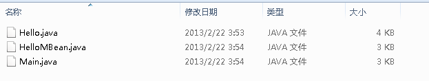
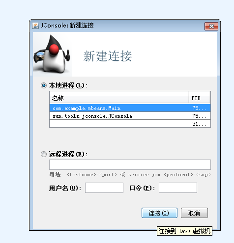
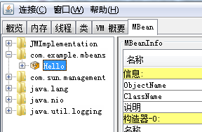
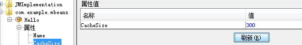
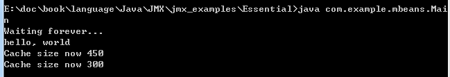
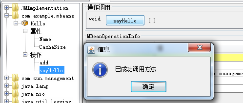
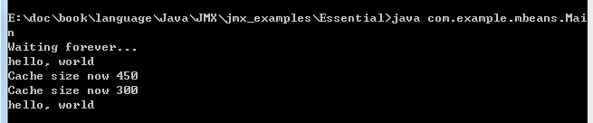

# JMX编程入门

## 一、理论部分

参考 《Java服务的监控指标框架》一文

## 二、实践部分

### 第一例子：标准MBeans 

标准的MBean的定义是：定义一个命名规范为SomethingMBean的Java接口，并通过一个命名为Something的Java类来实现这个接口。

样例代码

#### MBean接口

定义HelloMBean接口，包含了两个操作sayHello和add，两个属性Name和CacheSize相关的方法。 

```
package com.example.mbeans;

public interface HelloMBean {
    // operations

    public void sayHello();
    public int add(int x, int y);

    // attributes

    // a read-only attribute called Name of type String
    public String getName();

    // a read-write attribute called CacheSize of type int
    public int getCacheSize();
    public void setCacheSize(int size);
}
```

#### MBean 实现

Hello类实现了HelloMBean接口声明的方法。

```
package com.example.mbeans;

public class Hello implements HelloMBean {
    public void sayHello() {
        System.out.println("hello, world");
    }

    public int add(int x, int y) {
        return x + y;
    }

    /* Getter for the Name attribute.  The pattern shown here is
       frequent: the getter returns a private field representing the
       attribute value.  In our case, the attribute value never
       changes, but for other attributes it might change as the
       application runs.  Consider an attribute representing
       statistics such as uptime or memory usage, for example.  Being
       read-only just means that it can't be changed through the
       management interface.  */
    public String getName() {
        return this.name;
    }

    /* Getter for the CacheSize attribute.  The pattern shown here is
       frequent: the getter returns a private field representing the
       attribute value, and the setter changes that field.  */
    public int getCacheSize() {
        return this.cacheSize;
    }

    /* Setter for the CacheSize attribute.  To avoid problems with
       stale values in multithreaded situations, it is a good idea
       for setters to be synchronized.  */
    public synchronized void setCacheSize(int size) {
        this.cacheSize = size;

        /* In a real application, changing the attribute would
           typically have effects beyond just modifying the cacheSize
           field.  For example, resizing the cache might mean
           discarding entries or allocating new ones.  The logic for
           these effects would be here.  */
        System.out.println("Cache size now " + this.cacheSize);
    }

    private final String name = "Reginald";
    private int cacheSize = DEFAULT_CACHE_SIZE;
    private static final int DEFAULT_CACHE_SIZE = 200;
}
```

#### 资源管理

创建一个标准的JMX 代理：Main。

首先，Main通过调用java.lang.management.ManagementFactory类中的getPlatformMBeanServer()方法获取平台上的MBean server，如果MBean server不存在，getPlatformMBeanServer()方法会调用ManagementFactory.createMBeanServer()创建一个MBean Server。Main中获取MBeanServer实例并命名为*mbs*。每一个JMX MBean都必须有一个object name，object name是JMX中ObjectName类的实例，其定义需要符合JMX 规范中定义的语法，即必须包含一个domain和一系列key-properties。Main中object name命名为*name*，其domain为com.example.mbeans，key-property声明这个对象是Hello类型。Hello MBean注册到MBean server后，Main会一直等待。


```
package com.example.mbeans;

import java.lang.management.*;
import javax.management.*;

public class Main {
    /* For simplicity, we declare "throws Exception".  Real programs
       will usually want finer-grained exception handling.  */
    public static void main(String[] args) throws Exception {
        // Get the Platform MBean Server
        MBeanServer mbs = ManagementFactory.getPlatformMBeanServer();

        // Construct the ObjectName for the MBean we will register
        ObjectName name = new ObjectName("com.example.mbeans:type=Hello");

        // Create the Hello World MBean
        Hello mbean = new Hello();

        // Register the Hello World MBean
        mbs.registerMBean(mbean, name);

        // Wait forever
        System.out.println("Waiting forever...");
        Thread.sleep(Long.MAX_VALUE);
    }
}

```

#### 运行步骤

1、代码框架如图



2、编译

本地存放的路径：E:\doc\book\language\Java\JMX\jmx_examples\Essential\

```
javac com/example/mbeans/*.java
```

3、运行Main

```
java com.example.mbeans.Main
```

4、启动JConsole

```
jconsole
```

5、选择com.example.mbeans.Main,新建连接



6、MBeans tab页可以看到所有注册到MBean server的MBeans。



7、通过左侧MBean树形结构，可以对Hello MBean的属性与操作进行控制。

修改CacheSize属性值





调用sayHello()方法






8、退出JConsole。