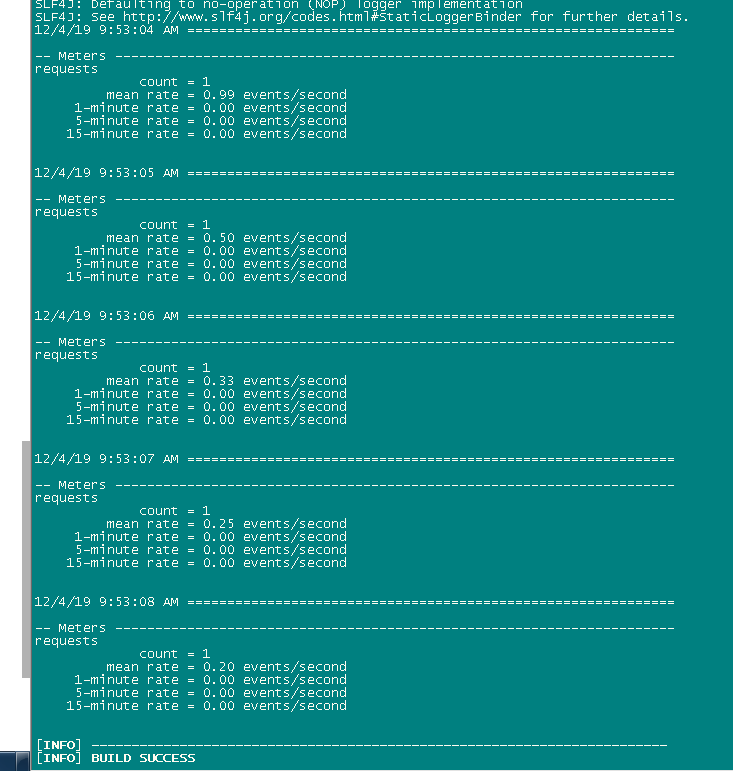
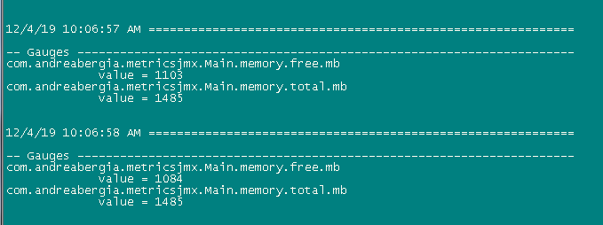
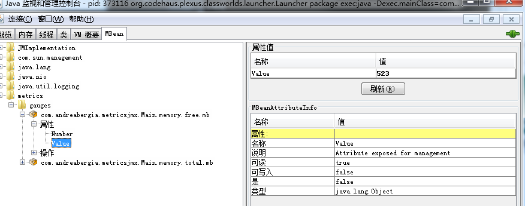
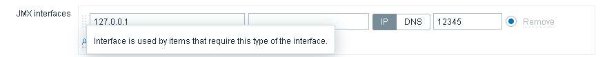
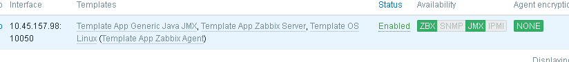
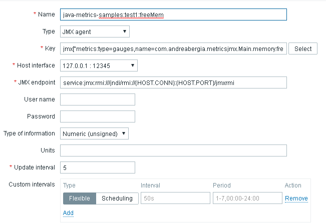
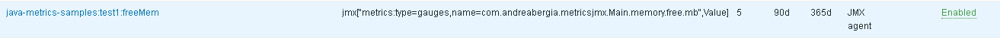
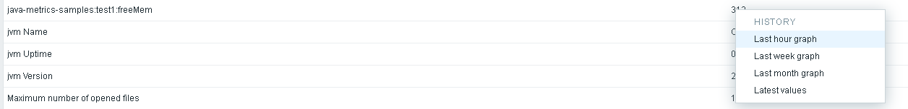
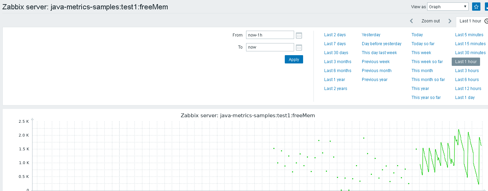

# Java Metrics 编程入门

## 理论篇

参考《Java服务的监控指标框架》

## 实践篇

### 第一个例子

生成一个Meter度量指标，将值定时上报到console控制台

```
  package sample;
  import com.codahale.metrics.*;
  import java.util.concurrent.TimeUnit;

  public class GetStarted {
    static final MetricRegistry metrics = new MetricRegistry();
    public static void main(String args[]) {
      startReport();
      Meter requests = metrics.meter("requests");
      requests.mark();
      wait5Seconds();
    }

  static void startReport() {
      ConsoleReporter reporter = ConsoleReporter.forRegistry(metrics)
          .convertRatesTo(TimeUnit.SECONDS)
          .convertDurationsTo(TimeUnit.MILLISECONDS)
          .build();
      reporter.start(1, TimeUnit.SECONDS);
  }

  static void wait5Seconds() {
      try {
          Thread.sleep(5*1000);
      }
      catch(InterruptedException e) {}
  }
}
```

pom文件

```
<?xml version="1.0" encoding="UTF-8"?>
<project xmlns="http://maven.apache.org/POM/4.0.0" xmlns:xsi="http://www.w3.org/2001/XMLSchema-instance" xsi:schemaLocation="http://maven.apache.org/POM/4.0.0 http://maven.apache.org/xsd/maven-4.0.0.xsd">
  <modelVersion>4.0.0</modelVersion>

  <groupId>sample</groupId>
  <artifactId>sample</artifactId>
  <version>0.0.1-SNAPSHOT</version>
  <name>Example project for Metrics</name>

  <dependencies>
    <dependency>
      <groupId>io.dropwizard.metrics</groupId>
      <artifactId>metrics-core</artifactId>
      <version>4.1.1</version>
    </dependency>
  </dependencies>
</project>
```

运行步骤

1、代码框架

```
│  pom.xml
│  readme.txt
│  
├─src
│  └─main
│      └─java
│          └─sample
│                  GetStarted.java
```

2、执行命令

```
mvn package exec:java -Dexec.mainClass=sample.GetStarted -Dexec.cleanupDaemonThreads=false
```

3、结果




### 第二个例子

代码

生成两个Gauge值上报到console和JMX

```
package com.andreabergia.metricsjmx;

import com.codahale.metrics.ConsoleReporter;
import com.codahale.metrics.Gauge;
import com.codahale.metrics.jmx.JmxReporter;
import com.codahale.metrics.MetricRegistry;

import java.util.ArrayList;
import java.util.List;
import java.util.concurrent.TimeUnit;

public class Main {
    public static void main(String[] args) throws InterruptedException {
        MetricRegistry metrics = new MetricRegistry();
        registerMemoryMetrics(metrics);
        initReporters(metrics);
        waitUntilKilled();
    }

    private static void registerMemoryMetrics(MetricRegistry metrics) {
        Gauge<Long> getFreeMemory = () -> toMb(Runtime.getRuntime().freeMemory());
        Gauge<Long> getTotalMemory = () -> toMb(Runtime.getRuntime().totalMemory());
        metrics.register(MetricRegistry.name(Main.class, "memory.free.mb"), getFreeMemory);
        metrics.register(MetricRegistry.name(Main.class, "memory.total.mb"), getTotalMemory);
    }

    private static long toMb(long bytes) {
        return bytes / 1024 / 1024;
    }

    private static void initReporters(MetricRegistry metrics) {
        initConsoleReporter(metrics);
        initJmxReporter(metrics);
    }

    private static void initJmxReporter(MetricRegistry metrics) {
        final JmxReporter reporter = JmxReporter.forRegistry(metrics).build();
        reporter.start();
    }

    private static void initConsoleReporter(MetricRegistry metrics) {
        final ConsoleReporter reporter = ConsoleReporter.forRegistry(metrics)
                .build();
        reporter.start(1, TimeUnit.SECONDS);
    }

    private static void waitUntilKilled() throws InterruptedException {
        List<String> memoryWaste = new ArrayList<>();
        char[] data = new char[1_000_000];
        while (true) {
            memoryWaste.add(String.copyValueOf(data));
            Thread.currentThread().sleep(100);
        }
    }
}
```

pom文件

```
<?xml version="1.0" encoding="UTF-8"?>
<project xmlns="http://maven.apache.org/POM/4.0.0" xmlns:xsi="http://www.w3.org/2001/XMLSchema-instance" xsi:schemaLocation="http://maven.apache.org/POM/4.0.0 http://maven.apache.org/xsd/maven-4.0.0.xsd">
  <modelVersion>4.0.0</modelVersion>

  <groupId>com.andreabergia.metricsjmx</groupId>
  <artifactId>metricsjmx</artifactId>
  <version>0.0.1-SNAPSHOT</version>
  <name>Example project for Metrics and expose them via JMX</name>

  
  <dependencies>
    <dependency>
      <groupId>io.dropwizard.metrics</groupId>
      <artifactId>metrics-core</artifactId>
      <version>4.1.1</version>
    </dependency>
	<dependency>
    <groupId>io.dropwizard.metrics</groupId>
    <artifactId>metrics-jmx</artifactId>
    <version>4.1.1</version>
	</dependency>
  </dependencies>
  <properties>
    <maven.compiler.source>1.8</maven.compiler.source>
    <maven.compiler.target>1.8</maven.compiler.target>
  </properties>
  
  <build>
        <plugins>            
            <plugin>
                <groupId>org.apache.maven.plugins</groupId>
                <artifactId>maven-assembly-plugin</artifactId>
                <version>3.2.0</version>  
				<executions>
					<execution>
						<phase>package</phase>
						<goals>
							<goal>single</goal>
						</goals>
					</execution>
				</executions>
                <configuration>      
					<descriptorRefs>  
						<descriptorRef>jar-with-dependencies</descriptorRef>  
					</descriptorRefs>  
				</configuration> 
            </plugin>
        </plugins>
    </build>

</project>
```

运行步骤

1、代码框架

```
│  pom.xml
│  readme.txt
│  
├─src
│  └─main
│      └─java
│          └─com
│              └─andreabergia
│                  └─metricsjmx
│                          Main.java
│                          
└─target
    │  metricsjmx-0.0.1-SNAPSHOT.jar

```

2、执行命令

```
mvn package exec:java -Dexec.mainClass=com.andreabergia.metricsjmx.Main -Dexec.cleanupDaemonThreads=false
```

3、运行结果，控制台输出如下图



4、关于JMX侧，通过jconsole可以查看



### 第二个例子的扩展

1、在157.98运行第二个例子

```
java \
-Dcom.sun.management.jmxremote \
-Dcom.sun.management.jmxremote.port=12345 \
-Dcom.sun.management.jmxremote.authenticate=false \
-Dcom.sun.management.jmxremote.ssl=false \
-cp /home/czw/language/java/java-metrics/test1/target/metricsjmx-0.0.1-SNAPSHOT-jar-with-dependencies.jar com.andreabergia.metricsjmx.Main
```

2、Zabbix的配置

 2.1安装 并配置java gateway

```
yum install zabbix-java-gateway

/etc/zabbix/zabbix_java_gateway.conf//配置文件使用默认

//开机自启
systemctl enable zabbix-java-gateway.service
systemctl restart zabbix-java-gateway.service


```

 2.2zabbix-server配置与重启

```
 //配置文件位置：
vim /etc/zabbix/zabbix_server.conf
//修改内容
JavaGateway=127.0.0.1  #修改为zabbix-java-gateway所在主机的ip地址，这里是和zabbix-server安装在同一台主机所以为127.0.0.1
JavaGatewayPort=10052  #因为zabbix-java-gateway  默认监控端口为10052
StartJavaPollers=5     #zabbix-java-gateway 默认启动工作线程数量为5

 systemctl restart zabbix-server.service
```

2.3 Web管理界面配置 

​        2.3.1 被监控程序所在主机的IP，及JMX监听端口

​          2.3.2主机添加 Generic Java JMX模板


​                    成功操作



​             2.3.3 添加监控项



添加成功后



Monitoring>Overview中选择图表方式显示历史数据



结果展示



## 总结

本文通过两个例子讲述了如何在自己的程序中使用Metrics类库，并将度量指标上报到console或JMX供后续的使用。进一步，在第二例子的基础上，我们使用zabbix提供的java gateway将JMX上自定义的度量数据收集到Zabbix server，并可以图表形式进行展现。

## 参考引用

1、https://metrics.dropwizard.io/4.1.1/getting-started.html#complete-getting-started

2、https://www.zabbix.com/documentation/3.4/manual/config/items/itemtypes/jmx_monitoring

3、https://blog.csdn.net/abcdu1/article/details/90075001


