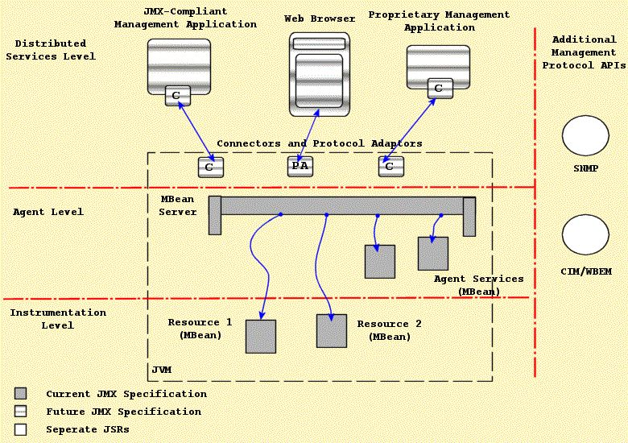
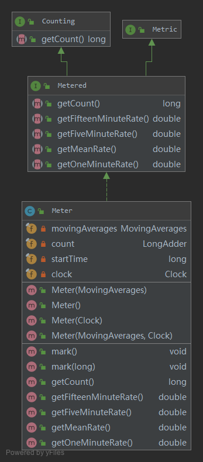
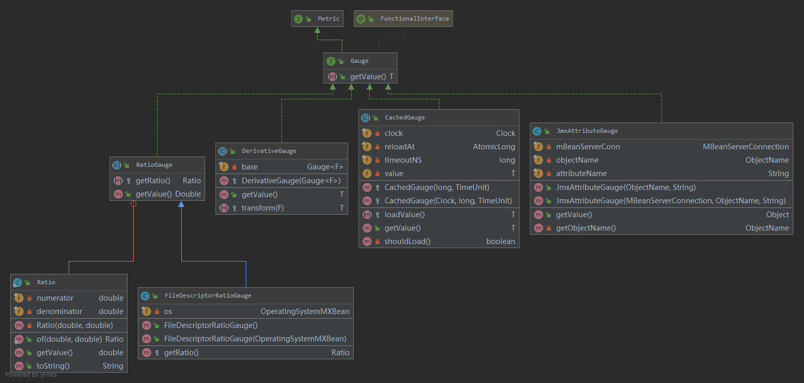
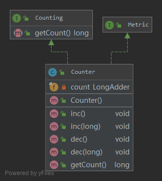

typora 

# 服务度量指标的监控框架设计

## 前言

​       在监控运维系统中通常要采集多种度量指标以监测业务系统的整体运行情况，通常这些指标可以分成两大类：一种是硬件相关的资源度量指标，诸如CPU使用率、磁盘吞吐量、网络IO等等；另一种就是系统相关的性能度量指标，诸如响应时间、并发用户数、吞吐量、吞吐率、事务TPS、点击量等等。本文集中讨论与系统性能相关的度量指标的监控框架，目前的业务系统多是JAVA实现，本文所讲服务也主要指Java服务。本框架主要分成度量指标生成、度量指标发布、度量指标采集三个主要模块，其技术框架设计如下图所示：


图1 度量指标监控技术框架

##  一、Metrics类库概述

​        Metrics是一个给Java服务的各项指标提供度量工具的包，在Java代码中嵌入Metrics代码，可以方便的对业务代码的各个指标进行监控目前最为流行的 metrics 库是来自 Coda Hale 的 dropwizard/metrics，该库被广泛地应用于各个知名的开源项目中。例如 Hadoop，Kafka，Spark，JStorm 、[Brooklin](https://mvnrepository.com/artifact/com.github.datastream/datastream-common) 中。最新发布的版本号为4.1.x。

其特性包括如下：

- 提供了对Ehcache、Apache HttpClient、JDBI、Jersey、Jetty、Log4J、Logback、JVM等的集成
- 支持多种Metric指标：Gauges、Counters、Meters、Histograms和Timers
- 支持多种Reporter发布指标
  - JMX、Console，CSV文件和SLF4J loggers
  - Ganglia、Graphite，用于图形化展示

## 二、JMX概述

​		 JMX（Java管理扩展），是一套给应用程序引入监控管理功能的接口。比如我们可以通过JMX来监控Tomcat的运行状态。JMX最主要的应用场景就是中间件的监控，配置文件的在线修改等。 



### 概念术语

**MBean**：是Managed Bean的简称。在JMX中MBean代表一个被管理的资源实例，通过MBean中暴露的方法和属性，外界可以获取被管理的资源的状态和操纵MBean的行为。事实上，MBean就是一个Java Object，同JavaBean模型一样，外界使用自醒和反射来获取Object的值和调用Object的方法，只是MBean更为复杂和高级一些。

**MBean Server**：MBean生存在一个MBean Server中。MBean Server管理这些MBean，并且代理外界对它们的访问。并且MBean Server提供了一种注册机制，是的外界可以通过名字来得到相应的MBean实例。

**JMX Agent**：Agent只是一个Java进程，它包括这个MBean Server和一系列附加的Mbean Service。当然这些Service也是通过MBean的形式来发布。

**ObjectName**：MBean在MBean Server中的唯一标识。

**Protocol Adapters and Connectors**

JMX Agent通过各种各样的Adapter和Connector来与外界(JVM之外)进行通信。同样外界（JVM之外）也必须通过某个Adapter和Connector来向JMX Agent发送管理或控制请求。

Adapter和Connector的区别在于：Adapter是使用某种Internet协议来与JMX Agent获得联系，Agent端会有一个对象(Adapter)来处理有关协议的细节。比如SNMP Adapter和HTTP Adapter。而Connector则是使用类似RPC的方式来访问Agent，在Agent端和客户端都必须有这样一个对象来处理相应的请求与应答。比如RMI Connector。

JMX Agent可以带有任意多个Adapter，因此可以使用多种不同的方式访问Agent。

### 三层架构：

**Instrumentation 层**：Instrumentation层主要包括了一系列的接口定义和描述如何开发MBean的规范。通常JMX所管理的资源有一个或多个MBean组成，因此这个资源可以是任何由Java语言开发的组件，或是一个JavaWrapper包装的其他语言开发的资源。

**Agent 层**：Agent用来管理相应的资源，并且为远端用户提供访问的接口。Agent层构建在Intrumentation层之上，并且使用并管理Instrumentation层内部描述的组件。通常Agent由一个MBean Server和多个系统服务组成。另外Agent还提供一个或多个Adapter或Connector以供外界的访问。

JMX Agent并不关心它所管理的资源是什么。

**Distributed Services层**：Distributed services层关心Agent如何被远端用户访问的细节。它定义了一系列用来访问Agent的接口和组件，包括Adapter和Connector的描述。


## 三、基本度量指标介绍

Metrics类库提供了如下监控指标：

- Gauges：记录一个瞬时值。例如一个待处理队列的长度。
- Histograms：统计单个数据的分布情况，最大值、最小值、平均值、中位数，百分比（75%、90%、95%、98%、99%和99.9%）
- Meters：统计调用的频率（TPS），总的请求数，平均每秒的请求数，以及最近的1、5、15分钟的平均TPS
- Timers：当我们既要统计TPS又要统计耗时分布情况，Timer基于Histograms和Meters来实现
- Counter：计数器，自带inc()和dec()方法计数，初始为0。
- Health Checks：用于对Application、其子模块或者关联模块的运行是否正常做检测。

### Meter

统计事件发生的次数和频率。



```
Meter meter = new Meter();
long initCount = meter.getCount();
assertThat(initCount, equalTo(0L));
 
meter.mark();
assertThat(meter.getCount(), equalTo(1L));
 
meter.mark(20);
assertThat(meter.getCount(), equalTo(21L));
 
double meanRate = meter.getMeanRate();
double oneMinRate = meter.getOneMinuteRate();
double fiveMinRate = meter.getFiveMinuteRate();
double fifteenMinRate = meter.getFifteenMinuteRate(); 
```


### Gauges

最简单的度量指标，只有一个简单的返回值。*Gauge*是一个接口，metrics-core模块提供了多个实现：*RatioGauge、CachedGauge、DerivativeGauge、JmxAttributeGauge*。



*RatioGauge*是一个抽象类，它记录的是一个比值关系。如下为示例代码：

```
public class AttendanceRatioGauge extends RatioGauge {
    private int attendanceCount;
    private int courseCount;
 
    @Override
    protected Ratio getRatio() {
        return Ratio.of(attendanceCount, courseCount);
    }
     
    // standard constructors
}
```

测试代码

```
RatioGauge ratioGauge = new AttendanceRatioGauge(15, 20);
 
assertThat(ratioGauge.getValue(), equalTo(0.75));
```

*CachedGauge*也是一个抽象类，用于缓存比较耗时的测量。

```
public class ActiveUsersGauge extends CachedGauge<List<Long>> {
     
    @Override
    protected List<Long> loadValue() {
        return getActiveUserCount();
    }
  
    private List<Long> getActiveUserCount() {
        List<Long> result = new ArrayList<Long>();
        result.add(12L);
        return result;
    }
 
    // standard constructors
}
```

测试代码部分：

```
Gauge<List<Long>> activeUsersGauge = new ActiveUsersGauge(15, TimeUnit.MINUTES);
List<Long> expected = new ArrayList<>();
expected.add(12L);
 
assertThat(activeUsersGauge.getValue(), equalTo(expected));
```

*DerivativeGauge*也是一个抽象类，它允许从其他的*Gauge*推导出度量值。

例子：

```
public class ActiveUserCountGauge extends DerivativeGauge<List<Long>, Integer> {
     
    @Override
    protected Integer transform(List<Long> value) {
        return value.size();
    }
 
    // standard constructors
}
```

代码中的*Gauge*的度量值是通过*ActiveUsersGauge*推导出的，下面的代码应该如预期执行。

```
Gauge<List<Long>> activeUsersGauge = new ActiveUsersGauge(15, TimeUnit.MINUTES);
Gauge<Integer> activeUserCountGauge = new ActiveUserCountGauge(activeUsersGauge);
 
assertThat(activeUserCountGauge.getValue(), equalTo(1));
```

*JmxAttributeGauge*用于访问其他基于JMX发布度量值的类库。

### Counter

计数器



```
Counter counter = new Counter();
long initCount = counter.getCount();
assertThat(initCount, equalTo(0L));
 
counter.inc();
assertThat(counter.getCount(), equalTo(1L));
 
counter.inc(11);
assertThat(counter.getCount(), equalTo(12L));
 
counter.dec();
assertThat(counter.getCount(), equalTo(11L));
 
counter.dec(6);
assertThat(counter.getCount(), equalTo(5L));
```

### Histogram

直方图用于跟踪流式数据的统计分布情况，比如最大值、最小值、均值、中值、标准差、百分比（75%）等。

```
Histogram histogram = new Histogram(new UniformReservoir());
histogram.update(5);
long count1 = histogram.getCount();
assertThat(count1, equalTo(1L));
 
Snapshot snapshot1 = histogram.getSnapshot();
assertThat(snapshot1.getValues().length, equalTo(1));
assertThat(snapshot1.getValues()[0], equalTo(5L));
 
histogram.update(20);
long count2 = histogram.getCount();
assertThat(count2, equalTo(2L));
 
Snapshot snapshot2 = histogram.getSnapshot();
assertThat(snapshot2.getValues().length, equalTo(2));
assertThat(snapshot2.getValues()[1], equalTo(20L));
assertThat(snapshot2.getMax(), equalTo(20L));
assertThat(snapshot2.getMean(), equalTo(12.5));
assertEquals(10.6, snapshot2.getStdDev(), 0.1);
assertThat(snapshot2.get75thPercentile(), equalTo(20.0));
assertThat(snapshot2.get999thPercentile(), equalTo(20.0));
```

*Histogram*的数据获取采用的蓄水池采用法（reservoir sampling）。实例一个*Histogram*对象时需要显式指定采用了哪种采样算法，metrics-core模块实现了如下算法： [*ExponentiallyDecayingReservoir*](http://metrics.dropwizard.io/3.1.0/apidocs/com/codahale/metrics/ExponentiallyDecayingReservoir.html), [*UniformReservoir*](http://metrics.dropwizard.io/3.1.0/apidocs/com/codahale/metrics/UniformReservoir.html), [*SlidingTimeWindowReservoir*](http://metrics.dropwizard.io/3.1.0/apidocs/com/codahale/metrics/SlidingTimeWindowReservoir.html), *[SlidingWindowReservoir](http://metrics.dropwizard.io/3.1.0/apidocs/com/codahale/metrics/SlidingWindowReservoir.html).* 

## 四、基于JMX的指标发布


## 五、度量指标采集


## 六、总结


## 七、参考文献

1、https://fangyeqing.github.io/2016/12/14/Java程序监控---Metrics/

2、https://metrics.dropwizard.io/4.1.0/getting-started.html

3、  Java Platform, Standard Edition    Java Management Extensions Guide  

4、  JavaTM Management Extensions (JMX)    Specification, version 1.4  

5、https://www.baeldung.com/dropwizard-metrics

6、 [http://www.cnblogs.com/54chensongxia/p/11703822.html](http://www.cnblogs.com/54chensongxia/p/11703822.html?utm_source=tuicool&utm_medium=referral) 


