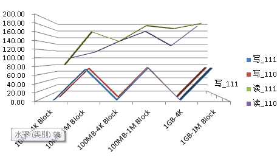

# 方案

## 机器配置

| 项   | 主机1                                                        | 主机2                                                        | 备注 |
| ---- | ------------------------------------------------------------ | ------------------------------------------------------------ | ---- |
| IP   | 10.45.157.110                                                | 10.45.157.111                                                |      |
| cpu  | Intel(R) Xeon(R) CPU E5-2670 v3 @ 2.30GHz*2 <br>(48核)       | Intel(R) Xeon(R) CPU E5-2670 v3 @ 2.30GHz*2<br>（48核）      |      |
| 内存 | 16G 2133MHz * 8                                              | 16G 2133MHz * 8                                              |      |
| 硬盘 | 系统盘：300G SAS 10500rpm * 2（Raid1）<br>数据盘：1T SAS 7200rpm * 10 | 系统盘：300G SAS 10500rpm * 2（Raid1）<br>数据盘：1T SAS 7200rpm * 10 |      |
| os   | CentOS  7.5.1804                                             | CentOS  7.5.1804                                             |      |
| 网络 | 双万兆双千兆四口网卡一块<br>四口千兆网卡一块                 | 双万兆双千兆四口网卡一块<br/>四口千兆网卡一块                |      |
| 版本 | CM                                                           | ZFM                                                          |      |

## 测试工具

参考：https://www.94ish.me/1935.html

下载的脚本工具 [LemonBenchIntl.sh](./files/LemonBenchIntl.sh) 

## 测试过程

```shell
#
./LemonBenchIntl.sh --mode full
#该工具支持分项测试
##硬盘目前只支持系统盘的测试
##数据盘的测试如下
#写 10MB-4K Block
dd if=/dev/zero of=/disk1/10M.test bs=4k count=2560 oflag=direct
#读 10MB-4K Block
dd if=/disk1/10M.test of=/dev/zero bs=4k count=2560 iflag=direct
#写 10MB-1M Block
dd if=/dev/zero of=/disk1/10M.test bs=1M count=10 oflag=direct
#读 10MB-1M Block
dd if=/disk1/10M.test of=/dev/zero bs=1M count=10 iflag=direct
#写 100MB-4K Block
dd if=/dev/zero of=/disk1/100M.test bs=4k count=25600 oflag=direct
#读 100MB-4K Block
dd if=/disk1/100M.test of=/dev/zero bs=4k count=25600 iflag=direct
#写 100MB-1M Block
dd if=/dev/zero of=/disk1/100M.test bs=1M count=100 oflag=direct
#读 100MB-1M Block
dd if=/disk1/100M.test of=/dev/zero bs=1M count=100 iflag=direct
#写 1GB-4K Block(有些慢，不做测试)
dd if=/dev/zero of=/disk1/1G.test bs=4k count=256000 oflag=direct
#读 1GB-4K Block
dd if=/disk1/1G.test of=/dev/zero bs=4k count=256000 iflag=direct
#写 1GB-1M Block
dd if=/dev/zero of=/disk1/1G.test bs=1M count=1000 oflag=direct
#读 1GB-1M Block
dd if=/disk1/1G.test of=/dev/zero bs=1M count=1000 iflag=direct

```


## 测试结果

### 机器1：10.45.157.110

#### 系统信息

```shell
#157.110
 Bench Start Time：	2020-03-23 10:49:27
 Bench Finish Time：	2020-03-23 11:11:59
 Test Mode：		Full Mode
 
-> System Information
 
 OS Release:		CentOS Linux 7.5.1804 (x86_64)
 CPU Model:		Intel(R) Xeon(R) CPU E5-2670 v3 @ 2.30GHz
 CPU Cache Size:	30720 KB
 CPU Number:		2 Physical CPUs, 12 Core(s)/CPU, 24 Thread(s)/CPU (Total 24 Core(s), 48 Threads)
 VirtReady:		Yes (Based on VT-x)
 Virt Type:		none
 Memory Usage:		30.17 GB / 125.64 GB
 Swap Usage:		0 KB / 4.00 GB
 Disk Usage:		17.64 GB / 209.61 GB
 Boot Device:		/dev/sdk2
 Load (1/5/15min):	0.31 0.23 0.17 

 -> Network Information

 IPV4 - IP Address:	[CN] 218.94.111.*
 IPV4 - ASN Info:	AS4134 (Chinanet)
 IPV4 - Region:		China Jiangsu Nanjing

 -> Media Unlock Test

 HBO Now:				Yes
 Bahamut Anime:				No
 Abema.TV:				No
 Princess Connect Re:Dive (Beta):	Failed (Unexpected Result: 000)
 BBC:					No
 Bilibili China Mainland Only:		Yes
 Bilibili Hongkong/Macau/Taiwan:	No
 Bilibili Taiwan Only:			No
```

#### CPU测试

```
-> CPU Performance Test (Standard Mode, 3-Pass @ 30sec)

 1 Thread Test:			849 Scores
 48 Threads Test:		20000 Scores
```


#### 内存测试

```
-> Memory Performance Test (Standard Mode, 3-Pass @ 30sec)

 1 Thread - Read Test :		19095.67 MB/s
 1 Thread - Write Test:		13996.49 MB/s
```


#### 硬盘测试

##### 系统盘

```
-> Disk Speed Test (4K Block/1M Block, Direct-Write)

 Test Name		Write Speed				Read Speed
 10MB-4K Block		52.8 MB/s (0.08 IOPS, 0.20 s)		98.7 MB/s (24085 IOPS, 0.11 s)
 10MB-1M Block		1.9 GB/s (1816 IOPS, 0.01 s)		2.8 GB/s (2716 IOPS, 0.00 s)
 100MB-4K Block		74.3 MB/s (0.06 IOPS, 1.41 s)		77.9 MB/s (19011 IOPS, 1.35 s)
 100MB-1M Block		2.2 GB/s (2127 IOPS, 0.05 s)		2.9 GB/s (2792 IOPS, 0.04 s)
 1GB-4K Block		76.4 MB/s (0.05 IOPS, 13.73 s)		84.2 MB/s (20562 IOPS, 12.45 s)
 1GB-1M Block		3.1 GB/s (2982 IOPS, 0.34 s)		3.9 GB/s (3705 IOPS, 0.27 s)
-> Disk Speed Test (4K Block/1M Block, Direct-Write)

 Test Name		Write Speed				Read Speed
 10MB-4K Block		59.9 MB/s (0.07 IOPS, 0.17 s)		21.8 MB/s (5314 IOPS, 0.48 s)
 10MB-1M Block		1.0 GB/s (989 IOPS, 0.01 s)		2.7 GB/s (2604 IOPS, 0.00 s)
 100MB-4K Block		75.6 MB/s (0.05 IOPS, 1.39 s)		73.7 MB/s (17981 IOPS, 1.42 s)
 100MB-1M Block		2.2 GB/s (2116 IOPS, 0.05 s)		3.0 GB/s (2906 IOPS, 0.03 s)
 1GB-4K Block		70.9 MB/s (0.06 IOPS, 14.78 s)		110 MB/s (26887 IOPS, 9.52 s)
 1GB-1M Block		2.2 GB/s (2112 IOPS, 0.47 s)		3.3 GB/s (3108 IOPS, 0.32 s)
 Generated by LemonBench on 2020-03-23T05:50:11Z Version 20200318 Intl BetaVersion
```

#####数据盘1

```shell
#写 10MB-4K Block
2560+0 records in
2560+0 records out
10485760 bytes (10 MB) copied, 21.7257 s, 483 kB/s
#读 10MB-4K Block
2560+0 records in
2560+0 records out
10485760 bytes (10 MB) copied, 0.106258 s, 98.7 MB/s
#写 10MB-1M Block
10+0 records in
10+0 records out
10485760 bytes (10 MB) copied, 0.142917 s, 73.4 MB/s
#读 10MB-1M Block
10+0 records in
10+0 records out
10485760 bytes (10 MB) copied, 0.090286 s, 116 MB/s
#写 100MB-4K Block
25600+0 records in
25600+0 records out
104857600 bytes (105 MB) copied, 215.918 s, 486 kB/s
#读 100MB-4K Block
25600+0 records in
25600+0 records out
104857600 bytes (105 MB) copied, 0.705 s, 149 MB/s
#写 100MB-1M Block
100+0 records in
100+0 records out
104857600 bytes (105 MB) copied, 1.38072 s, 75.9 MB/s
#读 100MB-1M Block
100+0 records in
100+0 records out
104857600 bytes (105 MB) copied, 0.590939 s, 177 MB/s
#写 1GB-4K Block
256000+0 records in
256000+0 records out
1048576000 bytes (1.0 GB) copied, 2162.27 s, 485 kB/s
#读 1GB-4K Block
256000+0 records in
256000+0 records out
1048576000 bytes (1.0 GB) copied, 7.7401 s, 135 MB/s
#写 1GB-1M Block
1000+0 records in
1000+0 records out
1048576000 bytes (1.0 GB) copied, 13.8975 s, 75.5 MB/s
#读 1GB-1M Block
1000+0 records in
1000+0 records out
1048576000 bytes (1.0 GB) copied, 5.50228 s, 191 MB/s
 
```


### 机器2：10.45.157.111

#### 系统信息

```
#157.111
 Bench Start Time：	2020-03-23 10:52:23
 Bench Finish Time：	2020-03-23 11:15:59
 Test Mode：		Full Mode
 
 -> System Information
 
 OS Release:		CentOS Linux 7.5.1804 (x86_64)
 CPU Model:		Intel(R) Xeon(R) CPU E5-2670 v3 @ 2.30GHz
 CPU Cache Size:	30720 KB
 CPU Number:		2 Physical CPUs, 12 Core(s)/CPU, 24 Thread(s)/CPU (Total 24 Core(s), 48 Threads)
 VirtReady:		Yes (Based on VT-x)
 Virt Type:		none
 Memory Usage:		18.44 GB / 125.64 GB
 Swap Usage:		0 KB / 4.00 GB
 Disk Usage:		2.84 GB / 209.61 GB
 Boot Device:		/dev/sdk2
 Load (1/5/15min):	0.06 1.65 2.33 

 -> Network Information

 IPV4 - IP Address:	[CN] 218.94.111.*
 IPV4 - ASN Info:	AS4134 (Chinanet)
 IPV4 - Region:		China Jiangsu Nanjing

 -> Media Unlock Test

 HBO Now:				No
 Bahamut Anime:				No
 Abema.TV:				No
 Princess Connect Re:Dive (Beta):	Failed (Unexpected Result: 000)
 BBC:					No
 Bilibili China Mainland Only:		Yes
 Bilibili Hongkong/Macau/Taiwan:	No
 Bilibili Taiwan Only:			No
```


#### CPU测试

```
 -> CPU Performance Test (Standard Mode, 3-Pass @ 30sec)

 1 Thread Test:			881 Scores
 48 Threads Test:		20000 Scores
```


#### 内存测试

```
 -> Memory Performance Test (Standard Mode, 3-Pass @ 30sec)

 1 Thread - Read Test :		20069.49 MB/s
 1 Thread - Write Test:		14630.44 MB/s

```


#### 硬盘测试

#####系统盘

```shell
 -> Disk Speed Test (4K Block/1M Block, Direct-Write)

 Test Name		Write Speed				Read Speed
 10MB-4K Block		64.9 MB/s (0.06 IOPS, 0.16 s)		113 MB/s (27700 IOPS, 0.09 s)
 10MB-1M Block		643 MB/s (613 IOPS, 0.02 s)		2.7 GB/s (2534 IOPS, 0.00 s)
 100MB-4K Block		97.8 MB/s (0.04 IOPS, 1.07 s)		131 MB/s (32065 IOPS, 0.80 s)
 100MB-1M Block		1.9 GB/s (1824 IOPS, 0.05 s)		3.0 GB/s (2847 IOPS, 0.04 s)
 1GB-4K Block		99.6 MB/s (0.04 IOPS, 10.53 s)		82.8 MB/s (20218 IOPS, 12.66 s)
 1GB-1M Block		2.8 GB/s (2675 IOPS, 0.37 s)		3.5 GB/s (3350 IOPS, 0.30 s)

```

##### 数据盘1

```shell
#写 10MB-4K Block
2560+0 records in
2560+0 records out
10485760 bytes (10 MB) copied, 21.5461 s, 487 kB/s
#读 10MB-4K Block
2560+0 records in
2560+0 records out
10485760 bytes (10 MB) copied, 0.130213 s, 80.5 MB/s
#写 10MB-1M Block
10+0 records in
10+0 records out
10485760 bytes (10 MB) copied, 0.142911 s, 73.4 MB/s
#读 10MB-1M Block
10+0 records in
10+0 records out
10485760 bytes (10 MB) copied, 0.061225 s, 171 MB/s
#写 100MB-4K Block
25600+0 records in
25600+0 records out
104857600 bytes (105 MB) copied, 215.343 s, 487 kB/s
#读 100MB-4K Block
25600+0 records in
25600+0 records out
104857600 bytes (105 MB) copied, 0.724122 s, 145 MB/s
#写 100MB-1M Block
100+0 records in
100+0 records out
104857600 bytes (105 MB) copied, 1.37153 s, 76.5 MB/s
#读 100MB-1M Block
100+0 records in
100+0 records out
104857600 bytes (105 MB) copied, 0.558698 s, 188 MB/s
#写 1GB-4K Block(有些慢，不做测试)
256000+0 records in
256000+0 records out
1048576000 bytes (1.0 GB) copied, 2154.87 s, 487 kB/s
#读 1GB-4K Block
256000+0 records in
256000+0 records out
1048576000 bytes (1.0 GB) copied, 5.83541 s, 180 MB/s
#写 1GB-1M Block
1000+0 records in
1000+0 records out
1048576000 bytes (1.0 GB) copied, 13.8016 s, 76.0 MB/s
#读 1GB-1M Block
1000+0 records in
1000+0 records out
1048576000 bytes (1.0 GB) copied, 5.41179 s, 194 MB/s
```

## 测试结论

1、157.110和157.111两台服务器的硬件配置相同，在误差允许范围内，cpu和内存的性能测试数据接近的。

2、硬盘部分，在写入性能上157.110和157.111数据是接近的，读取这块差异比较大，待后续的继续测试。

